# Real-Time Infrastructure Monitoring & Alerting System on AWS


---

# Project Overview

This project demonstrates how to build a **Real-Time Infrastructure Monitoring & Alerting System** for a **PHP Employee Registration Application** using **Amazon Web Services (AWS)**.

The objective is to deploy a web application on Amazon EC2, configure monitoring using Amazon CloudWatch, send real-time alerts using Amazon SNS, and audit AWS activities using AWS CloudTrail.

This project follows industry best practices and is designed to showcase practical Cloud and DevOps skills.

---

# Project Objectives

- Deploy a PHP Employee Registration Application
- Configure AWS Networking
- Launch and secure Amazon EC2
- Install NGINX, PHP, and MariaDB
- Configure CloudWatch Agent
- Monitor CPU, Memory, Disk and Network
- Create CloudWatch Dashboards
- Configure CloudWatch Alarms
- Send Email Notifications using Amazon SNS
- Enable CloudTrail for auditing
- Document the complete implementation

---

# Architecture Diagram


---

# AWS Services Used

| Service | Purpose |
|----------|----------|
| Amazon VPC | Network Isolation |
| EC2 | Web Server |
| IAM | Secure Access |
| Security Groups | Firewall |
| NGINX | Web Server |
| PHP | Application |
| MariaDB | Database |
| CloudWatch | Monitoring |
| CloudWatch Agent | Custom Metrics |
| SNS | Email Alerts |
| CloudTrail | Auditing |
| S3 | CloudTrail Logs |
| GitHub | Source Code Repository |

---

# Technology Stack

| Category | Technology |
|-----------|------------|
| Cloud | AWS |
| Compute | EC2 |
| Monitoring | CloudWatch |
| Notification | SNS |
| Logging | CloudWatch Logs |
| Audit | CloudTrail |
| Web Server | NGINX |
| Database | MariaDB |
| Language | PHP |
| Version Control | Git |
| Repository | GitHub |

---

# Folder Structure

```
real-time-infrastructure-monitoring-aws/

├── README.md
├── .gitignore

├── application/
│   ├── index.php
│   ├── add.php
│   ├── edit.php
│   ├── delete.php
│   ├── config.php
│   └── database.sql

├── cloudwatch/
│   └── amazon-cloudwatch-agent.json

├── scripts/
│   ├── install.sh
│   ├── health-check.sh
│   └── backup-database.sh

├── screenshots/

├── architecture/

```

---
## Prerequisites

Before setting up this project, ensure the following are available:

An active Amazon Web Services account  
Basic knowledge of EC2 instance management  
Amazon EC2 instance (Amazon Linux / Ubuntu)  
IAM role with permissions for CloudWatch, cloudtrail, 
Amazon CloudWatch configured for metrics and logs  
Amazon Simple Notification Service topic created for alerts    
NGINX, PHP, and MariaDB installed on EC2 instances  
Basic Linux command-line knowledge  

---

# Installation Steps

Follow these steps to set up the project:

---

# 📦 Step 1 – AWS Networking

## Objective

Create a secure network infrastructure for the application.

### Resources Created

- VPC (10.0.0.0/16)
- Public Subnet (10.0.1.0/24)
- Internet Gateway
- Public Route Table
- Security Group

### Security Group Rules

| Type | Port | Source |
|------|------|---------|
| SSH | 22 | My IP |
| HTTP | 80 | 0.0.0.0/0 |
| HTTPS | 443 | 0.0.0.0/0 |

### Screenshot

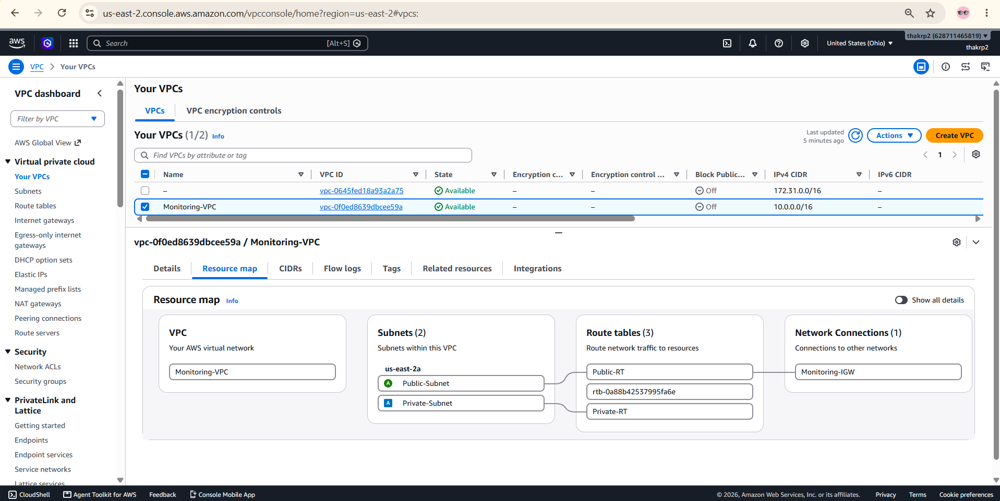

**Outcome**

✔ Secure AWS networking environment created.

---

# 💻 Step 2 – EC2 & IAM

## Objective

Launch an EC2 instance and configure secure access.

### EC2 Configuration

| Setting | Value |
|---------|-------|
| AMI | Amazon Linux 2023 |
| VPC | Custom VPC |
| Subnet | Public Subnet |
| Security Group | monitoring-sg |
| IAM Role | CloudWatchAgentServerPolicy |

### Screenshot

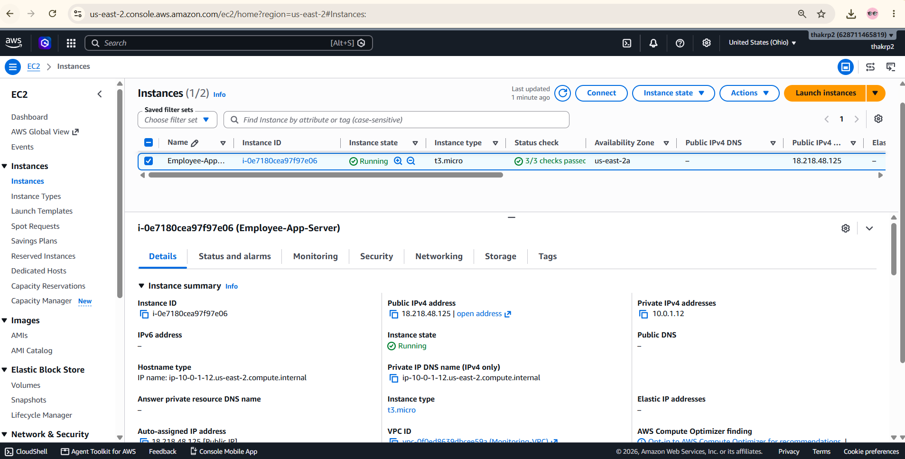
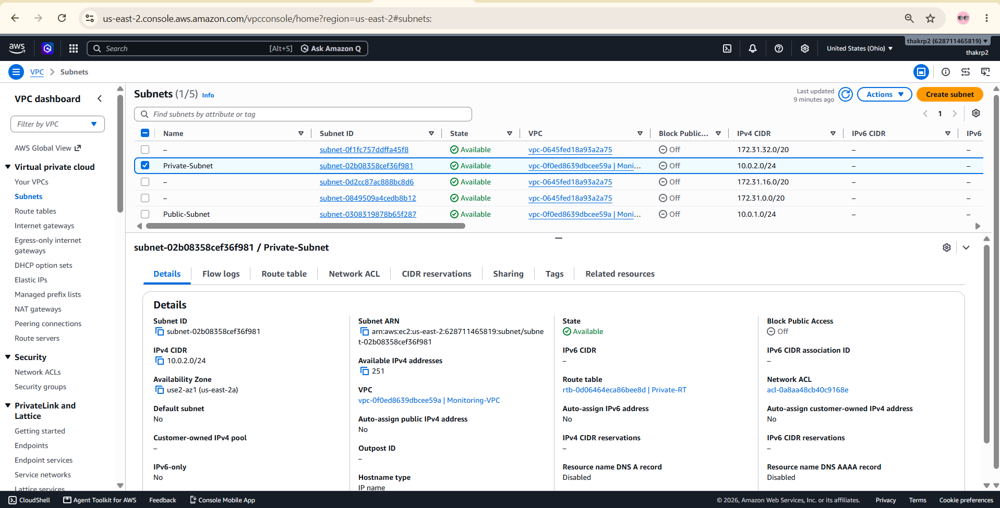

**Outcome**

✔ EC2 instance launched successfully with IAM Role attached.

---

# 🌐 Step 3 – Install NGINX, PHP & MariaDB

```bash
sudo yum update -y
sudo yum install nginx -y
sudo yum install php -y
sudo yum install mariadb-server -y
```

Start services:

```bash
sudo systemctl start nginx
sudo systemctl start php-fpm
sudo systemctl start mariadb
```

### Screenshot

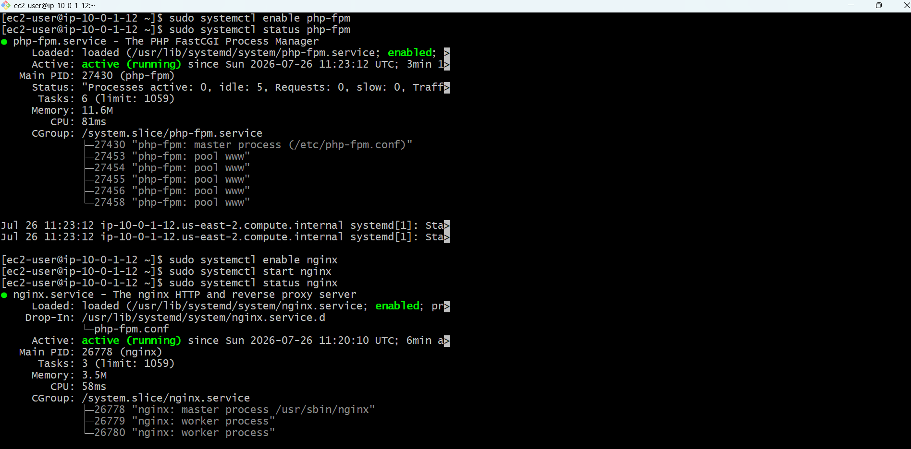

**Outcome**

✔ NGINX, PHP, PHP-FPM, and MariaDB installed successfully.

---

# 🖥 Step – Deploy PHP Employee Registration Application

Deploy the PHP CRUD application and configure the database.

```bash

cd /usr/share/nginx/html

### Configure Database

```sql
CREATE DATABASE employee_db;

CREATE USER employeeuser@localhost IDENTIFIED BY 'StrongPassword@123';

GRANT ALL PRIVILEGES ON employee_db.* TO employeeuser@localhost;

FLUSH PRIVILEGES;
```

### Import Database

```bash
mysql -u root -p employee_db < database.sql
```

### Verify CRUD Operations

- Add Employee
- View Employee
- Update Employee
- Delete Employee

### Screenshot

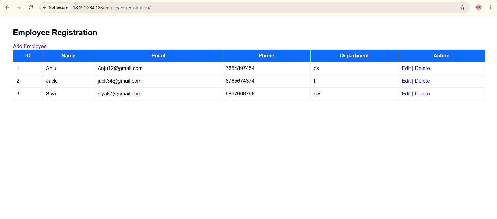

**Outcome**

✔ Employee Registration Application deployed successfully.

---

# 📊 Step 5 – Configure CloudWatch Agent

## Objective

Monitor EC2 metrics and application logs.

### Start CloudWatch Agent

```bash
sudo amazon-cloudwatch-agent-ctl \
-a fetch-config \
-m ec2 \
-c file:/opt/aws/amazon-cloudwatch-agent/etc/amazon-cloudwatch-agent.json \
-s
```

### Metrics Collected

- CPU Utilization
- Memory Usage
- Disk Usage
- Network In
- Network Out

### Logs Collected

- System Logs
- NGINX Access Logs
- NGINX Error Logs

### Screenshot

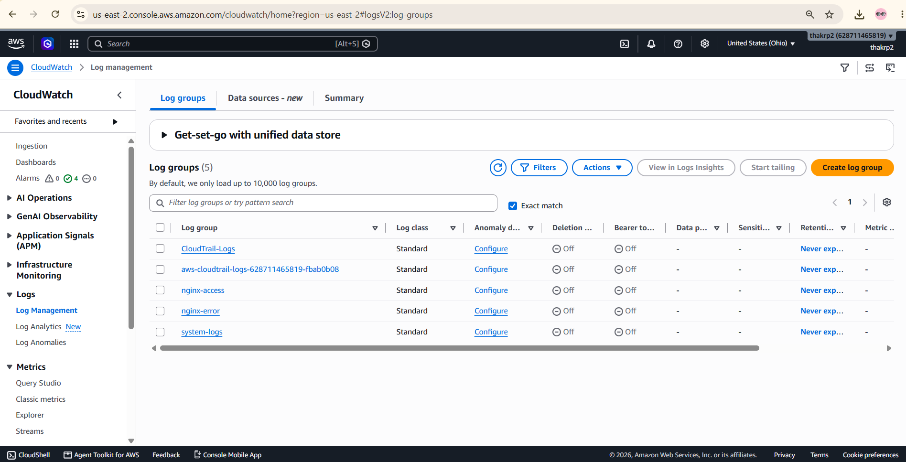

**Outcome**

✔ EC2 metrics and logs are visible in CloudWatch.

---

# 📈 Step 6 – CloudWatch Dashboard

## Objective

Create a centralized monitoring dashboard.

### Dashboard Widgets

- CPU Utilization
- Memory Utilization
- Disk Usage
- Network In
- Network Out

### Screenshot

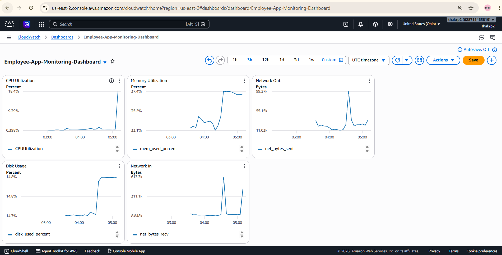

**Outcome**

✔ Real-time infrastructure monitoring dashboard created.

---

# 🚨 Step 7 – CloudWatch Alarms

## Objective

Automatically detect infrastructure issues.

### Alarms Created

- High CPU Utilization
- High Memory Usage
- High Disk Usage
- EC2 Status Check Failed

### Screenshot

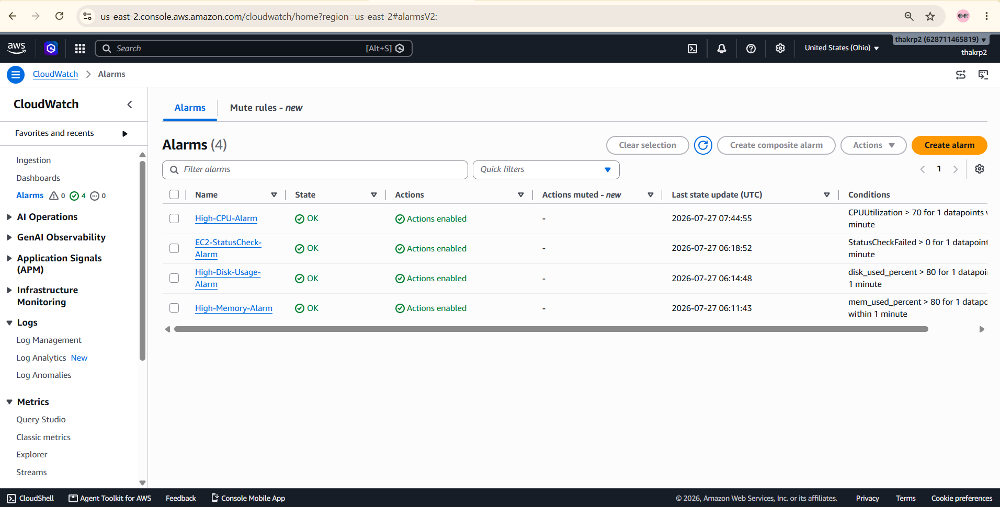

**Outcome**

✔ CloudWatch alarms trigger automatically when thresholds are exceeded.

---

# 📧 Step 8 – Amazon SNS Notifications

## Objective

Receive real-time email notifications.

### Tasks

- Create SNS Topic
- Subscribe Email
- Confirm Subscription
- Attach CloudWatch Alarms

### Example Email

```
ALARM

High CPU Usage

Threshold Exceeded
```

### Screenshot

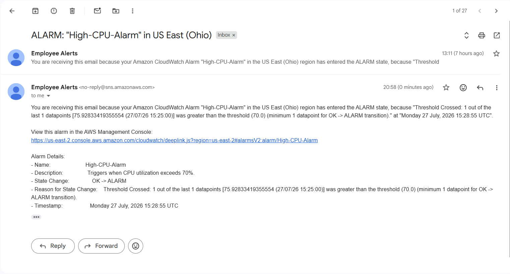

**Outcome**

✔ Email notifications are received whenever alarms are triggered.

---

# 🔍 Step 9 – AWS CloudTrail

## Objective

Track AWS API activities.

### Tasks

- Create CloudTrail Trail
- Store Logs in Amazon S3
- Send Logs to CloudWatch (Optional)
- Verify API Events

### Verify Events

- EC2 Start
- EC2 Stop
- IAM Activity
- Security Group Changes

### Screenshot

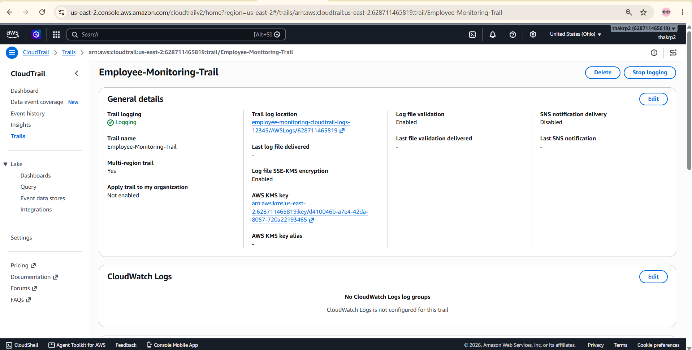

**Outcome**

✔ All AWS API activities are recorded for auditing.

---

# ✅ Step 10 – End-to-End Testing

## Objective

Validate the complete monitoring solution.

### Test CRUD Operations

- Add Employee
- Update Employee
- Delete Employee
- Verify Database Records

### Test CPU Alarm

```bash
sudo dnf install stress -y

stress --cpu 2 --timeout 300
```

### Test Memory Alarm

```bash
stress --vm 1 --vm-bytes 300M --timeout 300
```

### Validate

- CloudWatch Dashboard Updates
- Alarm State Changes
- SNS Email Notifications
- CloudTrail Event History

### Screenshot

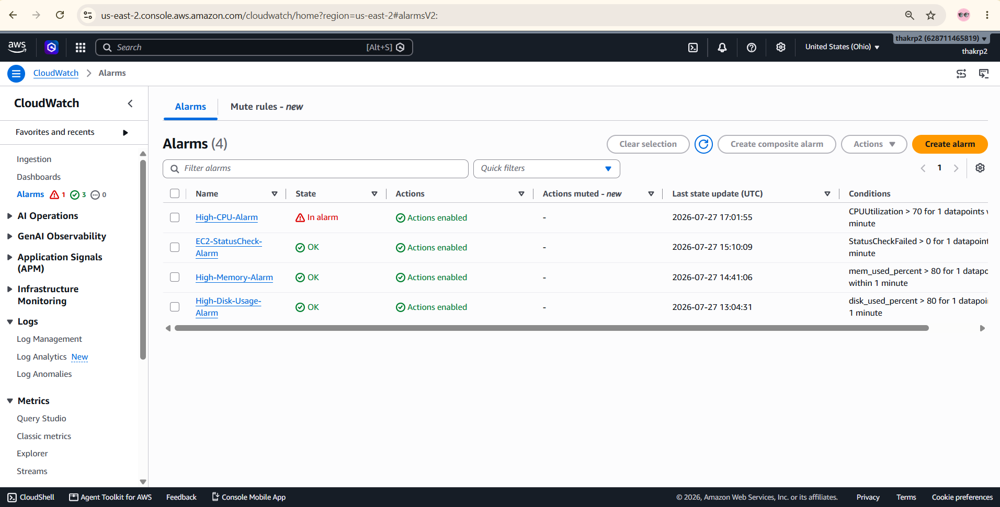
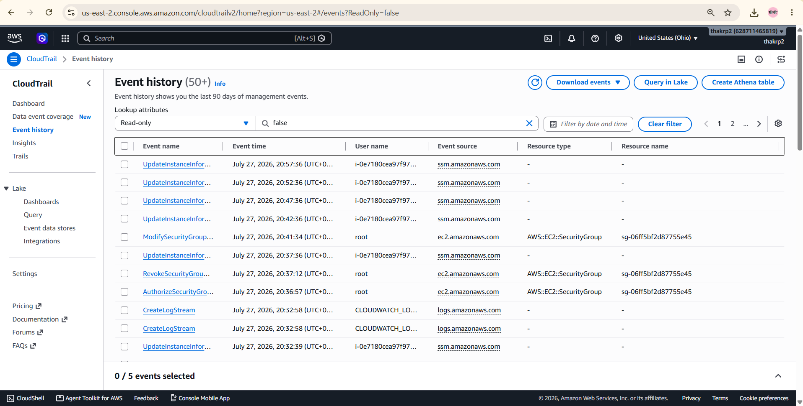

**Outcome**

✔ End-to-end monitoring, alerting, and auditing successfully validated.

---


# Future Improvements

- Application Load Balancer

- Auto Scaling Group

- Systems Manager

- AWS Backup

- AWS WAF

- AWS Config

- CloudWatch Synthetics

- Route 53

- SSL using ACM

- CI/CD Pipeline using GitHub Actions

---
#  Features

- Real-time monitoring
- Infrastructure observability
- Log monitoring
- Centralized logging
- Automated alert notifications
- Application health tracking


---

## Production-Oriented Monitoring Architecture Improvement

During the implementation, I initially configured CloudWatch metrics and log monitoring at the individual EC2 instance level. After completing the project, I realized that this approach was not ideal for a production-style scalable environment because instances inside an Auto Scaling Group are temporary and can be dynamically created or terminated.

I understood that a better production approach would be to redesign the monitoring architecture at the Auto Scaling Group level instead of depending on a single EC2 instance.

This would provide advantages such as:

- Automatic monitoring for newly launched instances  
- Better scalability and high availability  
- Centralized monitoring architecture  
- More production-ready cloud design  

If I continue this project in the next version, I would implement:

- CloudWatch Agent integration with Auto Scaling  
- Shared CloudWatch alarms and metrics  
- Centralized log collection  
- Event-driven alerting using Lambda and SNS  

This realization helped me better understand real-world cloud monitoring architecture and production-oriented DevOps practices.

---

## Conclusion

This project demonstrates a real-world, Real-Time Infrastructure Monitoring and Alerting System for a PHP-based Employee Registration Application on AWS. It leverages key AWS services—including Amazon VPC, EC2, IAM, CloudWatch, SNS, CloudTrail, and Systems Manager—to ensure secure application hosting, centralized monitoring, automated notifications, and comprehensive infrastructure auditing.

The infrastructure was built from the ground up, incorporating VPC networking, public subnets, Internet Gateway, route tables, security groups, and an EC2 instance configured with NGINX, PHP, and MariaDB. This hands-on implementation enhanced practical expertise in AWS cloud architecture and networking fundamentals. To enable proactive monitoring, the Amazon CloudWatch Agent was deployed with custom metrics, dashboards, and alarms tracking CPU, memory, disk, and network utilization. Amazon SNS was integrated to deliver real-time email alerts for critical events, while AWS CloudTrail provided detailed logging of API activities to strengthen security and compliance.

The project is fully documented with deployment scripts, CloudWatch configuration files, architecture diagrams, screenshots, and step-by-step instructions—making it straightforward to replicate, maintain, and adapt for real-world environments.

Overall, this project strengthened my understanding of:

- AWS cloud architecture and networking
- Application deployment using NGINX, PHP, and MariaDB
- Monitoring and observability using CloudWatch
- Real-time alerting with Amazon SNS
- Security auditing with AWS CloudTrail
- Professional documentation and GitHub project management

This project serves as a strong foundation for building production-grade DevOps and cloud-native systems.

---